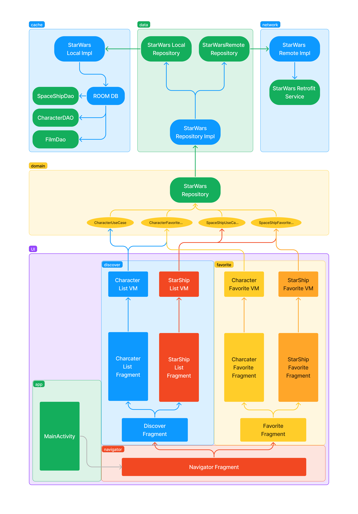

<h1 align="center">
  <a href="https://github.com/hexley21/ForceFacts">
    <!-- Please provide path to your logo here -->
    
  </a>
</h1>

  ForceFacts
  
 [Report a Bug](https://github.com/hexley21/ForceFacts/issues/new?assignees=&labels=bug&template=01_BUG_REPORT.md&title=bug%3A+)
  ·
[Request a Feature](https://github.com/hexley21/ForceFacts/issues/new?assignees=&labels=enhancement&template=02_FEATURE_REQUEST.md&title=feat%3A+)
  .
  [Ask a Question](https://github.com/hexley21/ForceFacts/issues/new?assignees=&labels=question&template=04_SUPPORT_QUESTION.md&title=support%3A+)

Table of Contents

- [About](#about)
  - [Built With](#built-with)
- [Roadmap](#roadmap)
- [Support](#support)
- [Project assistance](#project-assistance)
- [Contributing](#contributing)
- [Authors \& contributors](#authors--contributors)
- [License](#license)
- [Acknowledgements](#acknowledgements)

---

## About

### Built With

The ForceFacts app follows a modular architecture that promotes separation of concerns and modularity. It consists of the following modules, each responsible for specific functionality:

- **App Module**: The main module of the app that encompasses the app build and basic configuration elements.

- **Feature Modules**: It contains all user-interface and user-related components such as Fragments, Adapters, ViewHolders and so on..., it also stores of view-models, so ui components could gather data.

- **Core Modules**: The core module contains all necessary data, utility, shortly "backend" components that app needs to work. Also it stores elements needed in multiple modules, such as test constants, some ui elements and utilities.

- **Domain Module**: Encapsulates the core business logic and use cases of the app. It defines interfaces and contracts that the data layer must implement.

- **Data Module**: Implements the repositories defined in the domain module and acts as a bridge between the domain and the external data sources. It incorporates the following Android Architecture Components:
  - Room: Handles local database caching and retrieval.

- **Network Module**: Handles data retrieval from external APIs and utilizes Retrofit for network communication.

- **Model Module**: Contains data classes that are needed across the whole app

- **Cache Module**: An Android-specific module that focuses on storing and accessing data locally. It includes Room for local database caching and Shared Preferences for managing application preferences.

By following this modular architecture, the ForceFacts app achieves a clean separation of concerns, promotes code reusability, and facilitates easy maintenance and testing. The app also incorporates several Android Architecture Components, such as LiveData, ViewModel, Data Binding, and Room, to enhance its functionality and provide a smooth user experience.

Figma jam diagram

## Roadmap

See the [open issues](https://github.com/hexley21/ForceFacts/issues) for a list of proposed features (and known issues).

- [Top Feature Requests](https://github.com/hexley21/ForceFacts/issues?q=label%3Aenhancement+is%3Aopen+sort%3Areactions-%2B1-desc) (Add your votes using the 👍 reaction)
- [Top Bugs](https://github.com/hexley21/ForceFacts/issues?q=is%3Aissue+is%3Aopen+label%3Abug+sort%3Areactions-%2B1-desc) (Add your votes using the 👍 reaction)
- [Newest Bugs](https://github.com/hexley21/ForceFacts/issues?q=is%3Aopen+is%3Aissue+label%3Abug)

## Support

Reach out to the maintainer at one of the following places:

- [GitHub issues](https://github.com/hexley21/ForceFacts/issues/new?assignees=&labels=question&template=04_SUPPORT_QUESTION.md&title=support%3A+)
- Contact options listed on [this GitHub profile](https://github.com/hexley21)

## Project assistance

If you want to say **thank you** or/and support active development of ForceFacts:

- Add a [GitHub Star](https://github.com/hexley21/ForceFacts) to the project.
- Write interesting articles about the project on [Dev.to](https://dev.to/), [Medium](https://medium.com/) or your personal blog.

Together, we can make ForceFacts **better**!

## Contributing

First off, thanks for taking the time to contribute! Contributions are what make the open-source community such an amazing place to learn, inspire, and create. Any contributions you make will benefit everybody else and are **greatly appreciated**.

Please read [our contribution guidelines](docs/CONTRIBUTING.md), and thank you for being involved!

## Authors & contributors

The original setup of this repository is by [Avtandil Kupreishvili](https://github.com/hexley21).

For a full list of all authors and contributors, see [the contributors page](https://github.com/hexley21/ForceFacts/contributors).

## License

This project is licensed under the **Apache Software License 2.0**.

See [LICENSE](LICENSE) for more information.

## Acknowledgements

- [square - retrofit](https://github.com/square/retrofit) - A type-safe HTTP client for Android and the JVM. (Apache-2.0 license)
- [square - okhttp](https://github.com/square/okhttp) - Square’s meticulous HTTP client for the JVM, Android, and GraalVM. (Apache-2.0 license)
- [google - dagger](https://github.com/google/dagger) - A fast dependency injector for Android and Java. (Apache-2.0 license)
- [mockito - mockito](https://github.com/mockito/mockito) - Most popular Mocking framework for unit tests written in Java. (MIT license)
- [robolectric - robolectric](https://github.com/robolectric/robolectric) - Android Unit Testing Framework. (MIT license)
